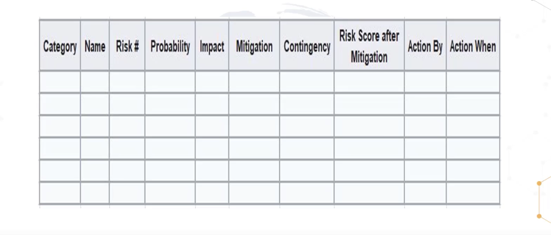

# Risk Management

Risk = Threat * Vulnearability
Total Risk = threat * vulnearbility * asset value
Residual Risk = Total risk - Countermeasures

## Qualitative Risk Analysis:
how likely is it to be happpen and how bad is it if it happends

## Quantitative Risk Analysis
What will it actually cost us in $

## Due Diligence :
Doing the research before implementations
research the vulnearbilyt

## Due Care
It is the implementations
DC : do correct
once you found fix it

## The Risk managment lifecycle is iterative
- identify the assets what we have either tangible or intangible

# Risk rejection is NEVER acceptable

## Risk assessment
- we find out there is some quality, how good it is , how bad it is
- we find out the quantity if this is risk how much the cost we gonna pay

## Risk Register
- as usually other register we do have risk register also, where we will define all the facts and figures

## Abbrivation
- Asset value (AV)
- Exposeure factor (EF)
- Single Loss Expectancy (SLE) = AV * EF
- Annual Rate of Occurrentce (ARO)
- Annualized Loss Expectancy (ALE)
- Total cost of ownership (TCO)

## Risk Tranferance
- we can buy the insurracne the of the laptop and data

## Risk mitigation
- Fix 99 vulnearbliyt but open a new one

## KGI (Key Goal Indicator)
- define measures that tell managment
- The goal is to overarching one
## KPI (Key Performance Indicators)
- This task is doing this well
- they ware is the baseline of function
## KRI (Key risk indicator)
- we do this we demostate the risk to the org
- how much is the risk
- how much cost

## Risk respond and Riks mitigation
- senior managment take the actions

## Risk and Control monitroing and Report
- The process is ongoin
- This is where we would use the KRIs (Key Risk Indicator)

## Risk Register
