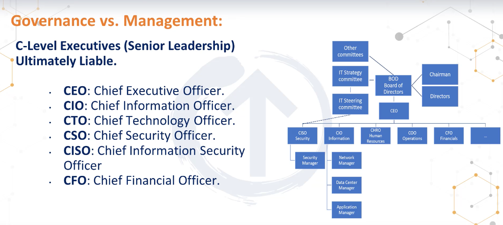

# Governance vs Management

## Governance
- Stackholder needs, conditions and options are evaluated to define
- Balanced agreed-upon enterprise objectives to be achieved.
- Risk appetite - Aggressive neutrols adverse
## Manament
- work on the direction decide by the governance team

