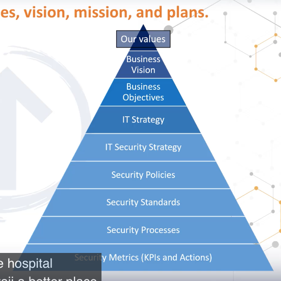

## Security Governance Principles

- Values: Ethics, Principles, Beliefs.
- Vision: Hope and Ambition
- Mission: Motivation and Purpose
- Strategic objectives: Plans, goals, and sequencing
- Action & KPIs: Actions Resouces, Outcomes, Owners, and Timeframes.
- Polices
- Standards
- Guidelines
- Procedures

