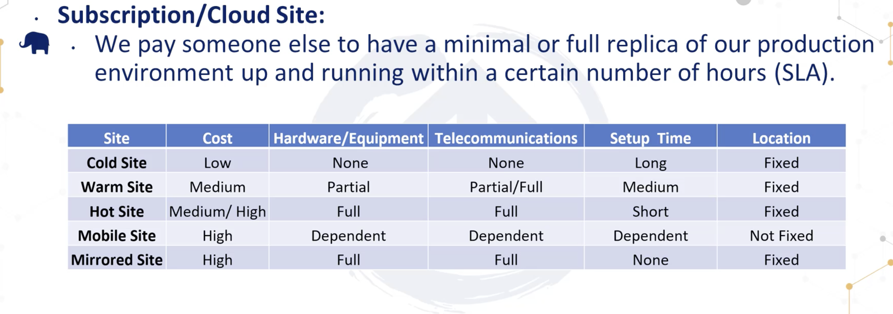

# Disaster Recovery Plan

- What is the objective and purpose?
- who will be the people or teams wh  will responsible in case any disruption heppen?
- what will these people do (our procedures ) when the disaster hits?

## summary
- everyone should know the disaster like starting informing to manager or VP
- its contineues improving the plan

## mitigation
- reduce the impact, and likeliness of a disaster.
## Preparation
- Build programs procedures and tools for our response
## response
## recovery

# BIA (Business Impact Analysis)
- identifies critiacal and non-critical organiztion system, functions and activities.
## RPO (Recovery Point of objective )
## MTD (Maximum Tolerable Downtime)
### MTD > RTO + WRT
- The time to rebuild the system and configure it for reinsertion into production must be less than or equal to our MTD
#### RTO (recover time object)
#### WRT (work recovery time)
- how much time required to configure a recovered system
### MTBF (Mean time between failure)
- how long new or repaired system
### MTTR (Mean time to repair)
- how long will take to repair the system
### MOR (Minikum operations requirement )
- this much requirment of the electictity
- this much connecitity requrie

## Recovery Strategies
- From out MTF we can determine our approach, how to handle the disasters and sageguard.
- We put in place3 and mitigate and recover from them
## Redendent Site
- Complete identitcal site our production system receavied
## hot Sites
- its critial application and same for redendacnt site
## Warm Site
- its simiar to host site, but is doent have real time data center
- we need to bring the data and store
- once ready we can transfer the traffice
- we need to find if the company accepble for this
- what happen to parmay site
## Cold Site
- A smaller but full data center with redundant UPS and other system
## Reciprocol Site Agrrement site
- your org have another company contract for similar  setup
## Subscription/Cloud Site
- We pay someone else to have full setup ready

## Mobile Site
- container in truck
- data center ont the wheel

## Lession Learned
- if we fix this now we need to find out why this happen
- find out why this happen how we can avoid this ?

- What is the object for this plan
- who people is response
- who will declar this is disasster
- who needs to inform to who
- we are fixing the problem
- BIA impact
-

