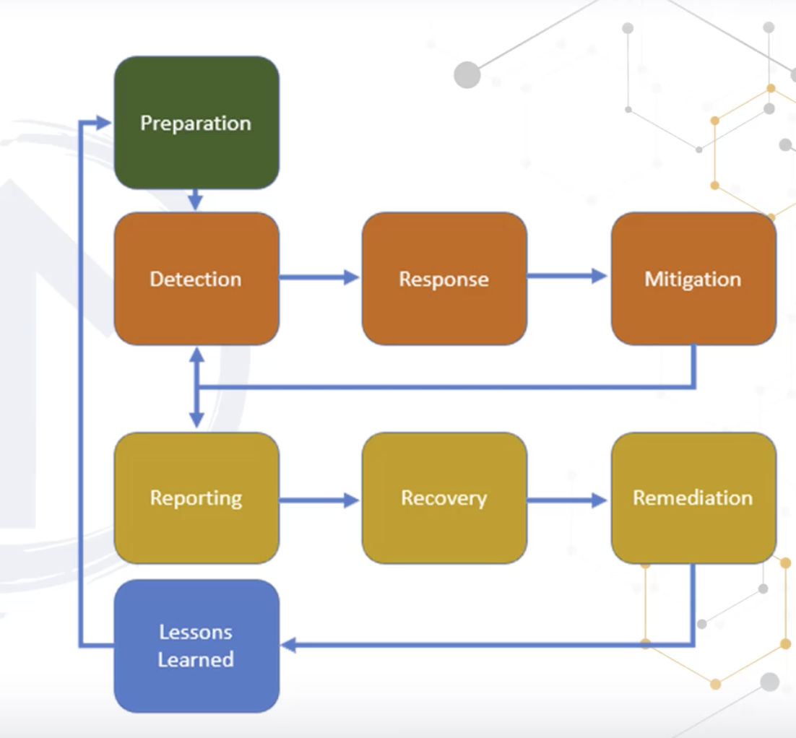

# Incident Mangment
- Involve the monitoirng and detection and secuirty events on our system and how we can react on those system.
- we need to train the people how to respond if this happen
- we need to define the process
- we need todo responses

## Incident Caategory
- Nature
    - can be anything raining
    - fire
    - power goes out
- Human
    - something happen by someone
- Envirment
    - some services down
    - attacher can hack our system
    - power grid
    - servers
    - switches

## Events
- obserbable event change
- if traffic is more than 80% alert

## Alers
- pre-configured
- we have to configured or system have already configured
- we need to confirm if actuall there

## Incident
- most of these call by people
- train your brain
- multiple adverse

## Problem
- we don't know how this happen
- next time it could be much wrose
- we need to find why this happen
- we need to fix the root cause

## Inconvience (non-disaster)
- disk some disk working some not we need to fix it this is non-disaster
- two servers in active -active one server failed we fixing toher one whyile the other one if working

## Emergency
- its happening right now
- its poenteil lose of liek
- we need todo right now
- snow strome
- our empoyee not go for work nothing can work
- we can find out some solution work from home like this

## disaster
- full system down, ISP is down
## Catastrophoen
- means our entire site is destory
- we need to have reduntdant location

Note: Some framework to use for Incident mangment

## IR lifecycle
- Prepartion
    - There are all steps we take for prepartion
- Detection
    - detect the evetns from wehre this is coming
    - detect correctly
    - its us doing something or us we are not doing something
    - someone start posting there files
    - intrustion dection or prevents system to use
    - we use this mostly places
- Response
    - senior system admin can work on this find out what happen
    - we either stop the entire system if there attached happen
- Mitigation
    - what went wrong
    - we need to find issue in the system and fix it
    - maybe we open the back door
    - we removed all the malware and
    - attacher might have other things
    - from all those reason we need to rebuidl the entire system
    - we need to go back in time
    - if this is new vuleariblyt than patch will not help
    -
- reporting
    - need to start reporing when the incidnet happen
    - we need to continues to reporting
    - we have two area tecnical area and non-technical area
    - we did inform there is incidne3t but we didn't informed the technical information
    - we need to involve the people
    - if we don't tell the poleple than start wring your resume
    - if system is down we notify the system owners
    - higher manage will take the actions
- Recovery
    - we very carefully restore the system
    - we put back in prodcution and we monitoring very closeing
    - if we found therre still malware
    - we should put system in sandbox enviarment see what happen if we put back system online
    - we have system that look like real ssytem we will see what attacher will do
    - if this is critical system we put back to prod and keep moniting close
    -
- remediation
    - we do remediation those system
    - someone break your house of you left open windows
    -
- lession learned
    - We fixed all the problem
    - system are online now
    - we have things todo
    - if we moveon than this can happen again, what went well this time what was the issue how to fix this ?
    - what they can do their report
    - senior managment team help us to build the report
- Root cause-analysis
    - we need to find out root cause
    - we need to fix it

### CIRT (Computer/cyber incident response team)
- Senior managment
    - they have to make the decsiton there are ultimate
- Manger
- Network team
- server team
- security team
- pr hr and legal team
- Auditor and Finance teeam
