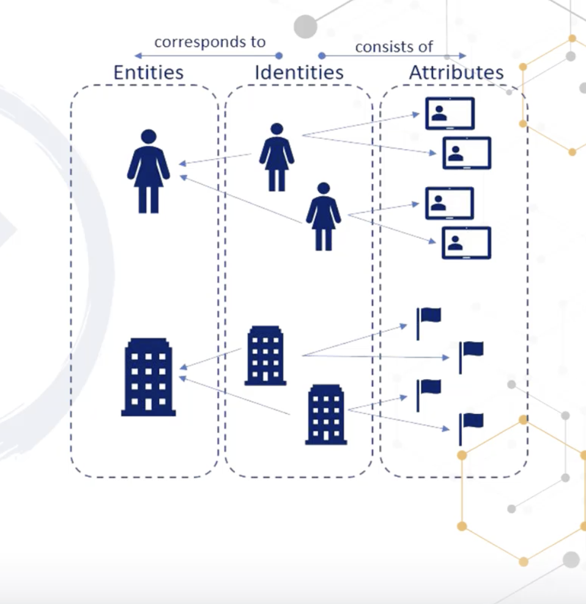

# Logical / Technical Access Controls

## Access Controls Type:
- Preventive
- Detective
- Corrective
- Recovery
- Deterrent
- Compensating

## Identity and Access prevision

## identity and Access prevision lifecycle
- we create access for some people which have access for certain time period
## Federated access
- is a common set of polices, pratices and protocol in place to manage the identity and trust
## SSO
- users sign on with same username and password
- there are many application which users need to login to one user need to have for all those applications
- if user leave the organization then we can disable the user
- its much easier but much less secure

## Access Control Systems
- Centrallize Pros
    - all system has the same security posture
    - physical security, logical are important
    -
- Centrolzie Corns
    - traffice overhead and response time
- Hybrid
    -

## Authorization
- Confidiential are very important
- rule back
- rback
- abac

## Discretionary Access Controls
- access to the object assing to that owner only
- someone give me read and write access only my data not others

## MAC
- Access to object determine by lables and clearance
- objects have lables to assing them
- clearance: subject have clearance to assing them

## RBAC
- base on the role of the entity
## ABAC
- base on the project of th entity
## Context baase access control
- like locations, time, sequence,
## Content base
- if any content not available than it will not work
- doctors can access base on the content

## Least Privilege and Need to know

## Least Privilege
- give the minimum access
## Need to know
- we give more information but there could be the reason
## Seprateion of the Duties
- more than one individual in the one single task is an internal control intended to be prevant the fraud
## Job rotations
- let say bob is the only person doing chequest the sign it
- should rotate the job is less fraud
## mandatory Vacation
- doen check one person is not always doing one task, soneone have to cover it. keep fraud fro happening and help to find it
## NDA (non disclosure agrrement )
- its just document to sing with the parties
- its company say don't leake the information
## Background checks
- do they have certification
- do they have credit checks
- do they have criminal status
## Privilege Monitoring
- The more access have an employee the more we have to keep eye on him

## Data Classification Policies

## Top Secret
- its secret data like mility data
- PII data, financcial data
- weapen blueprint, war plans
## Secret
- troops plan, deplyment plan, plan not include in TS plan, reports on shortage and weakenes
## Condidentials
- network diagram
- software
- reports
- they can access the network
- they can have access keys

## Unclissificed
- have the access
- sensitive
- PII, Payroll, Employee data
- Clearnance
## Confidenial
## private
## Sensivive
## public
