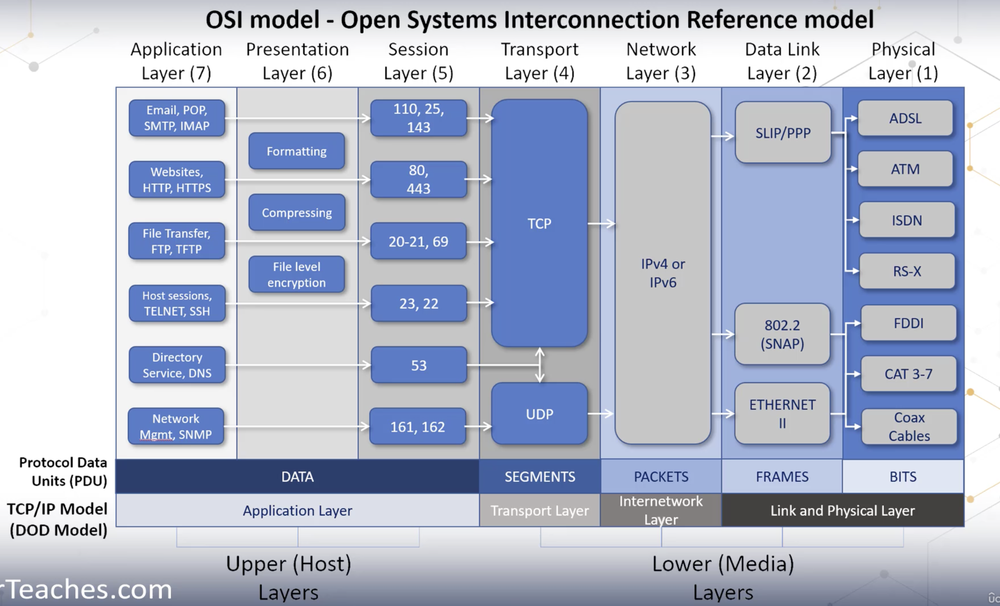

# A OSI Model

- A layerd network model that standarrize the communication function of the telecommunications computing system regardless of if their underlying internal structure or technologies

- it has 7 layers

- Physical Layer
    - ethernet cables
    - data are in 0s and 1s
    - wire fiber, waves hub parts
    - fiber cable much secure and expensive
    - copper cable you can bend
    - cheap and secure is fiber
    - Topologies
        - Bus, Star,ring, mesh partial/full
    - threat
        - Data emanation, theft, eavesdropping, sniffing, interference
- data link layer
    - trasport traffice two nodes logically
    - MAC address are unique
    - mac address can change and snoop it
    - threat
        - mac spoofing, and mac flooding
- network layer
    - Expand that many internet nodes on ip. The internet is IP based
    - protocols,
        - IP, ICMP, IPSEC, IGMP, IGRP, IKE, ISAKMP, IPX
    - threats
        - ping of death, ping floods, spoof of souce and directed to broadcast, IP modification and DHCP attacks
- transport
    - UDP
        - connection less traffic
        - it send the traffic doen;t care about the destination
        - its fast but not secure
    - TCP
        - where anything integrtiy is most important
        - for payment information
        - its alot slower but its secure
        - sync, --> SYN/CK --> syn
        - attachks : syn floods
    - hybrid model
        - something can send to UDP and something in TCP
- session
    - connection between two applciations
- presentation
    - has no protocols
    - formatting, compressing, encryption (file level)
- application
    - presented data to the users
    - https, http, ftp, smtp, imap, emails
    - threats
        - virus, worms, trojin, buffer overflow, application and OS vulearnbilyt
