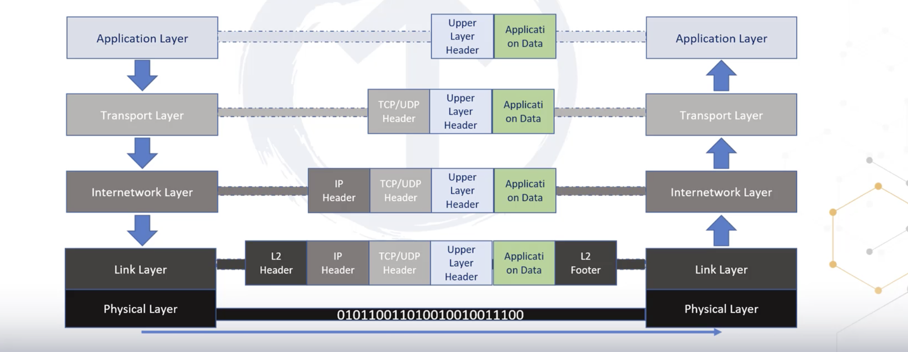

# TCP/IP Model

- there are 4 layers

- Link and physcial layer
- internetwork layer
- Transport Layer
    - traffice to send to ip and port number
    -
- Application layer
    - all the protocols layer provide users data

